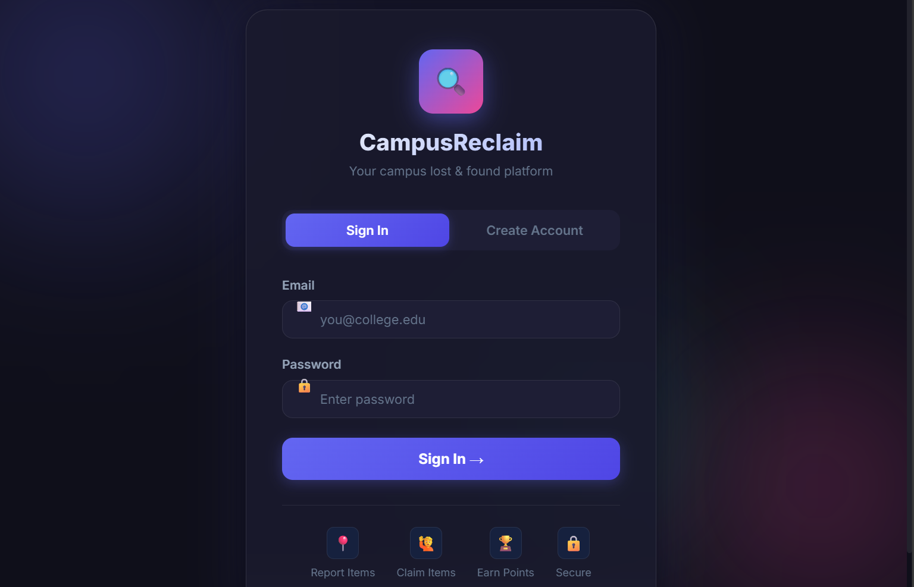
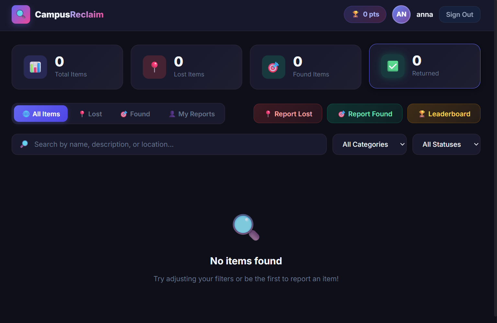
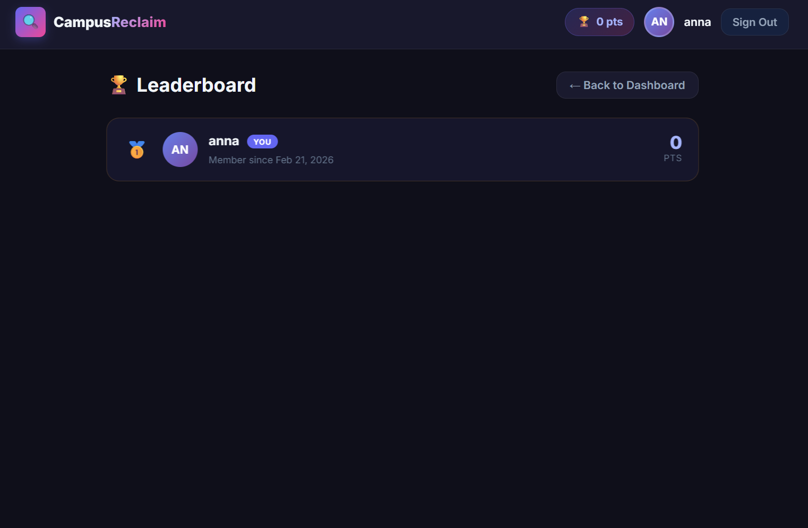
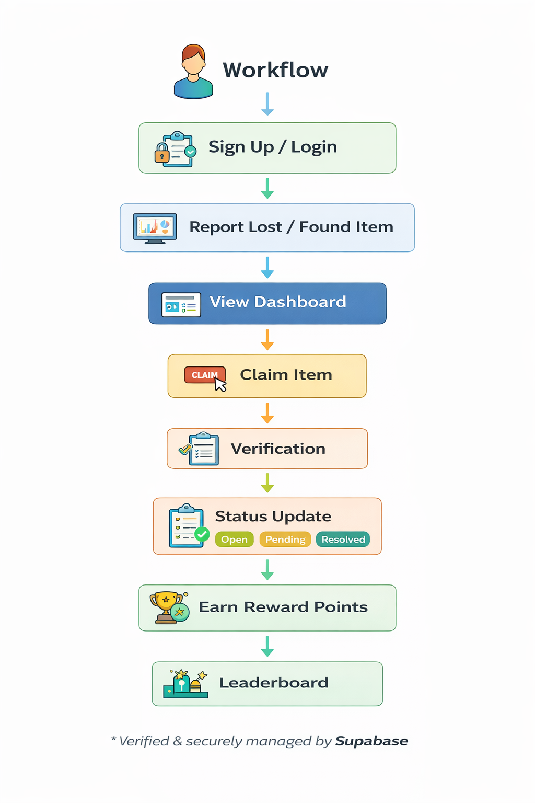

  

# Campas lost and found portal 🎯

## Basic Details

### Team Name: AxD

### Team Members
- Member 1: Aksa Rose Binu- Viswajyothi College of Engineering and Technology
- Member 2: Drisya Santhosh- Viswajyothi College of engineering and Technology

### Hosted Project Link

https://aksarose63-collab.github.io/campuslostandfound/index.html

### Project Description

Campus Lost and Found Portal is a web-based application that helps students report and track lost and found items within the campus. Users can log in, upload item details with images, and claim items. The system also includes a reward points feature to encourage honesty and community participation.

### The Problem statement

Students in college campuses frequently lose personal belongings such as ID cards, wallets, books, and electronic devices. There is no centralized system to report and track these items, which makes it difficult to reconnect lost items with their rightful owners.

### The Solution

We developed a web-based platform where students can create an account, report lost or found items, upload images, and track item status. The system allows users to claim items and confirm returns. A reward points system encourages students to honestly return lost belongings.

---

## Technical Details

### Technologies/Components Used

**For Software:**
- Languages used: java script,python,java
- Frameworks used: react,Django
- Libraries used: axiox,panda
- Tools used: antigravity,git

---

## Features

List the key features of your project:
- Feature 1:

- User Authentication
Students can securely sign up and log in using email authentication powered by Supabase.

- Feature 2:

- Report Lost & Found Items
Users can post details of lost or found items including title, description, location, and image upload.

- Feature 3:

- Claim & Status Tracking
Items can be marked as Open, Claimed, or Resolved, allowing users to track the recovery process.

- Feature 4:

- Reward Points & Leaderboard
Users earn reward points for returning lost items, and a leaderboard highlights top contributors to encourage honesty.

---

## Project Documentation

### For Software:

#### Screenshots (Add at least 3)

  

![Screenshot2]

  

![Screenshot3]

  

**System Architecture:**

  

**Application Workflow:**

  

---

#### Demo Output

## Project Demo

### Video
[Add your demo video link here - YouTube, Google Drive, etc.]

## Team Contributions
Aksa Rose Binu: Designed the website and added the main features like posting lost and found items.

Drisya Santhosh:  set up login system, tested the project, and helped manage GitHub.

---

## License
MIT license

---

Made with ❤️ at TinkerHub
